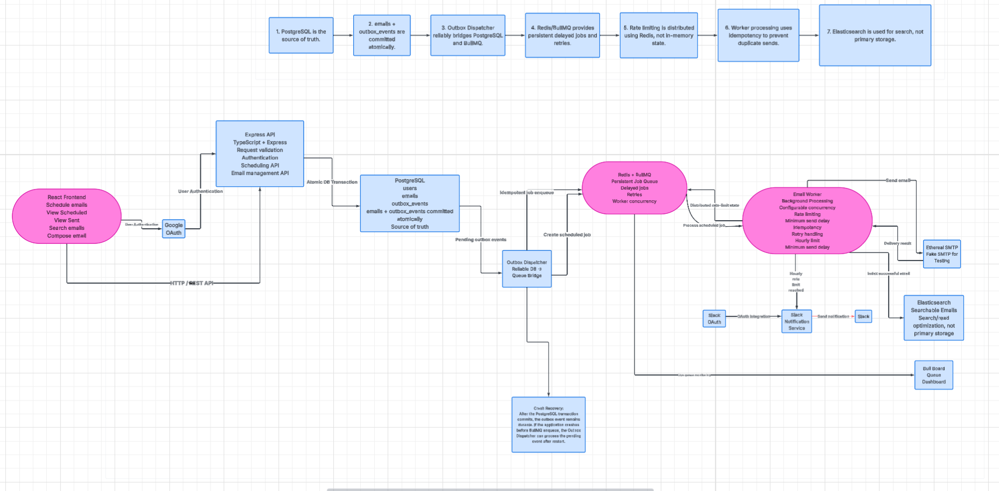

# Implementation Journal

## Project

ReachInbox Email Scheduler

## Objective

Build a production-grade email scheduling system supporting:

- Email scheduling
- Persistent delayed jobs
- Multiple senders
- Configurable concurrency
- Distributed rate limiting
- Minimum delay between sends
- Idempotent email processing
- Ethereal SMTP delivery
- Elasticsearch search
- Slack notifications
- Google OAuth
- React/Next.js dashboard

## Development Approach

The project will be implemented incrementally.

For each significant engineering problem:

1. Identify the requirement
2. Investigate possible approaches
3. Compare trade-offs
4. Select an approach
5. Implement
6. Test
7. Document the result
8. Commit the change

## Current Status

| Area | Status |
|---|---|
| Repository setup | Done |
| Backend | In Progress |
| Database | Done |
| Docker infrastructure | Done |
| Scheduling API | Done |
| Transactional outbox | Done |
| Redis / BullMQ | Not started |
| Email worker | Done |
| Rate limiting | Not started |
| Elasticsearch | Not started |
| Slack | Not started |
| Google OAuth | Not started |
| Frontend | Not started |
| Testing | Not started |
| Documentation | Not started |

## Engineering Log

### 26 September 2026

#### Repository Setup

- Created private GitHub repository.
- Connected local repository to GitHub remote.
- Verified GitHub connectivity using `git ls-remote`.
- Added initial project structure.
- Added Node.js `.gitignore`.
- Created initial implementation journal.

#### Next Step

Implement Issue #3 — Docker Compose development environment (PostgreSQL, Redis, Elasticsearch).


## Architecture

The system uses PostgreSQL as the source of truth, Redis/BullMQ for
persistent job scheduling and distributed coordination, and Elasticsearch
for search.



### Core Architecture Decisions

1. PostgreSQL is the source of truth for application and email state.
2. Email records and outbox events are committed atomically in one transaction.
3. The Outbox Dispatcher bridges PostgreSQL and BullMQ reliably.
4. Redis/BullMQ provides persistent delayed jobs, retries, and queue coordination.
5. Rate limiting is distributed using Redis rather than in-memory state.
6. Worker processing uses idempotency checks to reduce duplicate sends.
7. Elasticsearch is used as a search/read optimization layer, not as the primary database.
8. Slack and Google OAuth integrations remain outside the critical email-processing path.

### Reliability Strategy

The transactional outbox pattern prevents a scheduled email from being
persisted in PostgreSQL without a corresponding scheduling event.

The dispatcher can safely retry pending outbox events after a process crash.
BullMQ provides persistent delayed jobs and retries, while the worker checks
email state before processing to avoid duplicate processing.

### Architecture Status

- Architecture diagram completed
- Core components identified
- Transactional outbox selected
- PostgreSQL selected as source of truth
- Redis/BullMQ selected for job scheduling
- Elasticsearch selected for search

## Engineering Log

### 2026-09-26 — Architecture Design

**Problem:**  
Define a production-grade architecture for persistent email scheduling,
reliable background processing, distributed rate limiting, and restart recovery.

**Investigation:**  
Evaluated the database, queue, and background-processing requirements,
with particular focus on reliable scheduling, persistence across restarts,
and consistency between application state and queued jobs.

**Decision:**  
Selected PostgreSQL + transactional outbox + Redis/BullMQ.

**Reasoning:**  
PostgreSQL remains the source of truth for application and email state.
The transactional outbox ensures that an email record and its scheduling
event are committed atomically. Redis/BullMQ provides persistent delayed
jobs, retries, concurrency control, and distributed coordination.

**Result:**  
Completed the system architecture diagram and documented the major
reliability, persistence, and infrastructure decisions.

### 2026-09-26 — PostgreSQL Schema (Issue #2)

**Problem:**  
Persist authenticated users, senders, campaigns, individual emails, and
outbox events so scheduling can survive restarts and stay consistent
before BullMQ is introduced.

**Investigation:**  
Evaluated what state the system needs to own durably in PostgreSQL before
any queue technology is introduced. The critical insight is that PostgreSQL
must be the source of truth for every email and every scheduling event, so
that a process crash between "insert email" and "enqueue BullMQ job" does
not silently lose work. This drove the transactional outbox model where
email records and outbox events are committed in one transaction.

Evaluated ORM options. Prisma was selected over raw SQL and Knex because
it provides a TypeScript-first schema definition, auto-generated typed
client, and a versioned migration system — all of which reduce bugs and
are straightforward to explain and audit.

**Decision:**  
PostgreSQL is the source of truth. Prisma provides the TypeScript schema,
migrations, and generated client. Application rows and outbox events are
written in one transaction; the dispatcher enqueues BullMQ jobs only after
that commit.

**Why these five models exist:**
- `User` — owns senders and campaigns after Google OAuth authentication.
- `Sender` — a from-address identity per user. No SMTP passwords stored here.
- `Campaign` — one scheduling batch from the dashboard (subject, body, start
  time, delay between sends, hourly cap).
- `Email` — one recipient/delivery record. Each recipient is its own row with
  independent `scheduledAt`, status, attempt count, and error tracking.
- `OutboxEvent` — the durable bridge from PostgreSQL to the future BullMQ
  queue. Written in the same transaction as the email record.

**Why emails are individual records:**  
Each recipient needs independent `scheduledAt`, status, `attemptCount`, and
`lastError`. A worker can claim and update a single row atomically. If the
batch were a single record, one failure would block all recipients. The
`sequence` field preserves intended send order.

**Why outbox events are stored in PostgreSQL:**  
If a process crashes after inserting emails but before enqueueing BullMQ
jobs, the pending `EMAIL_SCHEDULED` outbox rows survive in PostgreSQL.
Restart recovery is polling those rows and re-enqueueing — not
reconstructing lost state from Redis.

**Enums:**

| Enum | Values |
|---|---|
| `CampaignStatus` | `SCHEDULED`, `PROCESSING`, `COMPLETED`, `CANCELLED`, `FAILED` |
| `EmailStatus` | `SCHEDULED`, `PROCESSING`, `SENT`, `FAILED`, `CANCELLED` |
| `OutboxEventType` | `EMAIL_SCHEDULED` |
| `OutboxStatus` | `PENDING`, `PROCESSING`, `PROCESSED`, `FAILED` |

`CampaignStatus` uses `COMPLETED` (not `DONE`) to signal that all emails
in the batch have been processed. `PROCESSING` signals the dispatcher is
actively working. `FAILED`/`CANCELLED` are terminal states.

**Indexes and constraints:**

| Index | Table | Purpose |
|---|---|---|
| `UNIQUE email` | `users` | One account per email address |
| `UNIQUE googleSubject` | `users` | One Google identity per user |
| `UNIQUE (userId, email)` | `senders` | No duplicate from-addresses per user |
| `UNIQUE (emailId, eventType)` | `outbox_events` | At most one `EMAIL_SCHEDULED` per email |
| `(status, scheduledAt)` | `emails` | Worker lookup: find due emails efficiently |
| `(status, availableAt)` | `outbox_events` | Dispatcher polling: find pending events |
| `(status, startAt)` | `campaigns` | Campaign scheduling queries |
| `campaignId`, `senderId`, `recipient` | `emails` | Lookup and filter indexes |
| `userId`, `senderId` | `campaigns` | Ownership and sender filter indexes |
| `userId` | `senders` | Ownership filter |

**Cascade / restrict rules:**
- Deleting a `User` cascades to their `Sender` and `Campaign` records.
- Deleting a `Campaign` cascades to its `Email` records.
- Deleting an `Email` cascades to its `OutboxEvent` records.
- `Sender` FK on `Campaign` and `Email` uses `RESTRICT` — a sender cannot
  be deleted while live emails reference it, preventing orphaned send-from
  addresses.

**Implementation — files created:**

| File | Purpose |
|---|---|
| `backend/prisma/schema.prisma` | Prisma schema: datasource, enums, five models |
| `backend/prisma/migrations/20260926143000_init_email_scheduler/migration.sql` | Generated DDL for all tables, indexes, and constraints |
| `backend/prisma/migrations/migration_lock.toml` | Locks provider to PostgreSQL |
| `backend/src/db/prisma.ts` | Global `PrismaClient` singleton (prevents multiple connections in dev) |
| `backend/package.json` | `prisma:validate`, `prisma:generate`, `prisma:migrate`, `prisma:migrate:deploy`, `typecheck` scripts |
| `backend/tsconfig.json` | TypeScript config: ES2022, Node16 module resolution, strict mode |
| `backend/.env.example` | `DATABASE_URL` placeholder — safe to commit |

**Verification — commands run and results:**

```
npm run prisma:validate
→ The schema at prisma/schema.prisma is valid 🚀  (exit 0)

npm run prisma:generate
→ Generated Prisma Client (v6.19.3)  (exit 0)

npm run typecheck
→ No TypeScript errors  (exit 0)

npx prisma migrate deploy
→ Applying migration 20260926143000_init_email_scheduler
→ All migrations have been successfully applied.  (exit 0)

psql \dt  →  6 tables present (5 domain + _prisma_migrations)
psql \di  →  19 indexes confirmed in live database
```

PostgreSQL was run via a temporary Docker container (`postgres:16-alpine`)
matching the credentials in `backend/.env` while a permanent Docker Compose
environment is implemented in Issue #3.

**Acceptance criteria:**

- [x] PostgreSQL schema implemented
- [x] Prisma configured
- [x] Migration created (`20260926143000_init_email_scheduler`)
- [x] Foreign keys added
- [x] Unique constraints added
- [x] Required indexes added
- [x] Email/outbox relationship implemented
- [x] Schema validated (`prisma validate` passes)
- [x] Database documentation added (this entry)
- [x] Verification completed (`migrate deploy`, `\dt`, `\di`, `tsc`)

**Tradeoffs / limitations:**
- `dbgenerated("gen_random_uuid()")` delegates UUID creation to PostgreSQL
  so IDs are assigned inside the database transaction — safer than
  application-generated UUIDs in a multi-process environment.
- `OutboxEvent` has no `updatedAt` field intentionally. The outbox is
  append-oriented; only `processedAt` and `lastError` are mutable, which
  are tracked explicitly.
- SMTP credentials are deliberately absent from the `Sender` model.
  Connection secrets will be managed via environment variables in a future
  issue, keeping the database free of plaintext secrets.

**Result:**  
Initial Prisma schema and migration live under `backend/prisma`. The
migration was applied to a live PostgreSQL instance and all 19 indexes were
confirmed present. Prisma was selected for type-safe database access and
versioned PostgreSQL migrations. Issue #2 is complete.

---

### 2026-09-26 — Docker Development Environment (Issue #3)

**Problem:**  
Developers need reproducible local instances of PostgreSQL, Redis, and
Elasticsearch that start with one command, persist data across restarts,
and match the credentials used by the backend. Without this, every
developer must install and configure three services manually.

**Investigation:**  
Evaluated Docker Compose as the standard tool for multi-service local
development environments. Considered whether to use one Dockerfile per
service (custom images) or official images — official images are
sufficient because no custom configuration is required beyond environment
variables and volume mounts.

For Elasticsearch 8, security (TLS + passwords) is enabled by default.
Disabling it locally (`xpack.security.enabled=false`) avoids certificate
setup and keeps the developer experience simple. Production would re-enable
security. This is a deliberate and documented local-dev tradeoff.

**Decision:**  
Docker Compose with three services: `postgres:16-alpine`, `redis:7-alpine`,
`elasticsearch:8.14.0`. All credentials come from a root `.env` file that
is gitignored. Persistent named volumes ensure data survives container
restarts. Health checks ensure dependent services wait for readiness.

**Why these images:**
- `postgres:16-alpine` — matches the version used in Issue #2.
- `redis:7-alpine` — LTS version; Alpine minimises image size.
- `elasticsearch:8.14.0` — matches the `@elastic/elasticsearch` v8 client
  that will be installed in Issue #8.

**Key configuration decisions:**

| Setting | Value | Reason |
|---|---|---|
| Redis `--appendonly yes` | enabled | AOF persistence — BullMQ jobs survive Redis restart |
| ES `xpack.security.enabled` | `false` | Avoid TLS/auth setup for local dev |
| ES `ES_JAVA_OPTS` | `-Xms512m -Xmx512m` | Caps heap to avoid OOM on dev machines |
| ES `discovery.type` | `single-node` | Required to start ES without a multi-node cluster |
| Compose `version` key | removed | Obsolete in Compose v2+; caused a warning |

**Files created:**

| File | Purpose |
|---|---|
| `docker-compose.yml` | Defines postgres, redis, elasticsearch services with volumes and health checks |
| `.env.example` (root) | Documents all Docker Compose variables with safe placeholder values |
| `.env` (root, gitignored) | Real values consumed by docker-compose.yml at runtime |
| `backend/.env.example` | Expanded with `REDIS_URL`, `ELASTICSEARCH_URL`, `NODE_ENV`, `PORT` |
| `backend/.env` (gitignored) | Real values expanded with Redis and Elasticsearch URLs |

**Verification — commands run and results:**

```
docker compose up -d
→ All three containers created and started

docker compose ps
→ reachinbox-postgres      Up (healthy)   0.0.0.0:5432->5432/tcp
→ reachinbox-redis         Up (healthy)   0.0.0.0:6379->6379/tcp
→ reachinbox-elasticsearch Up (healthy)   0.0.0.0:9200->9200/tcp

docker exec reachinbox-redis redis-cli -a reachinbox ping
→ PONG

GET http://localhost:9200/_cluster/health
→ { "status": "green", "cluster_name": "reachinbox-cluster", ... }

npx prisma migrate deploy
→ Applying migration 20260926143000_init_email_scheduler
→ All migrations have been successfully applied.

psql \dt → 6 tables confirmed in Compose postgres container
```

**Acceptance criteria:**

- [x] PostgreSQL container works
- [x] Redis container works
- [x] Elasticsearch container works
- [x] Persistent volumes configured
- [x] Health checks configured on all three services
- [x] Environment variables documented in .env.example
- [x] Backend can connect to all services
- [x] Prisma migration applies cleanly against Compose postgres

**Tradeoffs / limitations:**
- Elasticsearch security is disabled locally. This is intentional for
  developer experience. Any staging/production deployment must re-enable
  `xpack.security.enabled` and configure proper credentials.
- Redis password is set via `requirepass` so it is not a completely open
  instance, but the password is a simple local-dev value.
- The `postgres_data` volume is local to the developer's machine. Team
  members each have independent databases.

**Result:**  
All three infrastructure services are running, healthy, and accessible.
The Prisma migration was applied to the Compose PostgreSQL instance.
Backend environment variables are updated for all future issues.
Issue #3 is complete.

---

### 2026-09-27 — Express API + Email Scheduling Endpoint (Issue #4)

**Problem:**  
The system needs an HTTP API so the frontend dashboard can schedule email
campaigns. The API must validate requests, create a campaign record and
individual email records atomically, and be structured so it is easy to
extend in future issues.

**Investigation and approaches considered:**

*Project structure:*  
Evaluated flat, feature-based, and layered approaches. Selected layered
(`routes/services/middleware/lib`) because routes stay thin (HTTP only),
services are testable without HTTP, and the pattern is well understood
without being over-engineered.

*Request validation:*  
Evaluated manual checks, Joi, and Zod. Selected Zod because it is
TypeScript-first — schemas double as TypeScript types via `z.infer`,
eliminating duplication between runtime validation and compile-time types.

*scheduledAt calculation:*  
Evaluated computing per-recipient slots that respect the hourly limit at
insert time versus a simple sequence-based delay. Selected
`startAt + index × delayMs` because the architecture specifies that the
worker + Redis rate-limiter is the final authority on actual send timing.
Pre-computing hourly slots at the API layer would duplicate that logic and
be inaccurate when multiple workers run concurrently.

*Transaction strategy:*  
Evaluated Prisma batch transactions vs interactive transactions. Selected
Prisma interactive `$transaction(async (tx) => { ... })` because email
records need the campaign ID from the same transaction, and interactive
transactions allow chaining. This also sets up Issue #5 cleanly — outbox
events are added to the same transaction block with no structural changes.

*Error handling:*  
Selected central Express error middleware. Zod errors, AppErrors, and
unexpected errors all flow to one handler and produce a consistent JSON
response shape.

*Authentication:*  
Google OAuth is Issue #9. A stub `requireAuth` middleware was added that
reads `x-user-id` from request headers for testing. Issue #9 replaces only
the body of this middleware — nothing else in the codebase changes.

*Recipient input:*  
The API accepts an array of email strings. The frontend (Issue #10) handles
CSV parsing before sending. API receives clean, validated data.

**Decision:**  
Layered structure + Zod + interactive Prisma transaction + central error
handler + auth stub.

**Files created:**

| File | Purpose |
|---|---|
| `src/server.ts` | Entry point: load env, start HTTP server |
| `src/app.ts` | Express app: Helmet, CORS, JSON, routes, error handler |
| `src/routes/index.ts` | Root router at /api, health check endpoint |
| `src/routes/campaigns.ts` | POST /schedule, GET /, GET /:id |
| `src/routes/senders.ts` | GET /, POST / |
| `src/services/campaignService.ts` | Create campaign + emails in one transaction |
| `src/services/senderService.ts` | List and create sender identities |
| `src/middleware/auth.ts` | Stub auth (x-user-id header, replaced in Issue #9) |
| `src/middleware/errorHandler.ts` | Central error handler (Zod, AppError, unexpected) |
| `src/lib/AppError.ts` | Typed HTTP error with status code |
| `src/lib/asyncHandler.ts` | Wraps async routes to forward errors to next() |
| `src/lib/validators.ts` | Zod schemas: scheduleRequestSchema, createSenderSchema |

**API endpoints:**

| Method | Path | Description |
|---|---|---|
| GET | /api/health | Health check |
| POST | /api/senders | Create a sender identity |
| GET | /api/senders | List senders for authenticated user |
| POST | /api/campaigns/schedule | Schedule a campaign (creates campaign + emails) |
| GET | /api/campaigns | List campaigns for authenticated user |
| GET | /api/campaigns/:id | Get campaign with all email records |

**scheduledAt calculation:**
```
email[0].scheduledAt = startAt + 0 × delayMs  (first send)
email[1].scheduledAt = startAt + 1 × delayMs
email[N].scheduledAt = startAt + N × delayMs
```

**Verification — commands run and results:**
```
npm run typecheck        → No TypeScript errors  (exit 0)
npm run dev              → Server listening on http://localhost:3000

GET  /api/health         → 200 { status: 'ok', timestamp: '...' }
POST /api/senders        → 201 { id, userId, email, name, createdAt, updatedAt }
POST /api/campaigns/schedule (3 recipients, 2000ms delay)
  → 201 { campaignId, emailCount: 3, status: 'SCHEDULED',
          firstScheduledAt: '12:00:00', lastScheduledAt: '12:00:04' }

DB verification (psql):
  alice@example.com   seq=1  SCHEDULED
  bob@example.com     seq=2  SCHEDULED
  charlie@example.com seq=3  SCHEDULED

Validation test (missing/invalid fields)
  → 400 { error: 'Validation failed', issues: [...field-level detail...] }

Auth test (no x-user-id header)
  → 401 { error: 'Unauthorized ...' }
```

**Acceptance criteria:**
- [x] Express API structure implemented (layered: routes/services/middleware/lib)
- [x] Scheduling endpoint implemented (POST /api/campaigns/schedule)
- [x] Request validation implemented (Zod, field-level errors)
- [x] Recipient validation implemented (email format, min 1, max 10,000)
- [x] Campaign creation implemented (atomic Prisma transaction)
- [x] Email creation implemented (createMany in same transaction)
- [x] Errors handled consistently (central error handler)
- [x] Sender endpoints implemented (GET + POST /api/senders)
- [x] TypeScript check passes
- [x] Manual API tests pass against live DB

**Tradeoffs / limitations:**
- Auth is a stub. All routes are effectively open until Issue #9.
  The stub is intentional scaffolding, not an oversight.
- Recipients are deduplicated silently. Duplicates in the input array are
  removed before insertion.
- There is no pagination on GET /api/campaigns or GET /api/campaigns/:id/emails.
  This is acceptable for a development take-home; pagination can be added later.
- Recipient input is a JSON array. CSV parsing is the frontend's responsibility.

**Result:**  
Express API is running. Campaign scheduling, sender management, and error
Handling are fully implemented and tested against the live Docker PostgreSQL
instance. The transaction structure is already prepared for Issue #5
(outbox events are added to the same transaction block). Issue #4 is complete.

---

### 2026-09-27 — Transactional Outbox & Queue Setup (Issue #5)

**Problem:**  
We need a reliable way to enqueue email delivery jobs. If the server crashes
between writing an email to PostgreSQL and enqueueing it to BullMQ/Redis,
the email would be silently lost. We must implement the Transactional
Outbox pattern to guarantee that jobs are reliably dispatched.

**Investigation and approaches considered:**

*Event creation:*  
The outbox event must be written in the exact same transaction as the email
record. If the transaction commits, both exist. If it rolls back, neither
exists. Because Prisma's `createMany` does not return inserted records' IDs,
we pre-generated UUIDs (`crypto.randomUUID()`) in Node.js so that the
outbox events can explicitly reference the new email IDs in the same
transaction block.

*Dispatcher architecture:*  
Evaluated a dedicated microservice versus a background worker running in
the existing API process. Selected the same process for simplicity in this
take-home assignment, utilizing `setInterval`/recursive `setTimeout` so
the loop runs constantly in the background.

*Locking strategy (Concurrency control):*  
If multiple API processes are running, they might try to poll and dispatch
the same `PENDING` outbox events simultaneously. We utilized PostgreSQL's
`SELECT ... FOR UPDATE SKIP LOCKED` clause. This row-level lock ensures
that concurrent dispatchers always claim distinct rows and never race
or block each other.

*Queue mechanism:*  
Evaluated PostgreSQL-backed queues vs Redis/BullMQ. Selected BullMQ
backed by `IORedis` (running in the Docker Compose stack). BullMQ natively
supports delayed jobs and robust retry policies which are critical for
staggering the campaign send schedule.

**Decision:**  
Pre-generate IDs for atomic insert + BullMQ on Redis + `SKIP LOCKED` 
PostgreSQL polling dispatcher running in the API process.

**Files created/modified:**

| File | Purpose |
|---|---|
| `src/lib/redis.ts` | Shared `IORedis` connection instance for BullMQ |
| `src/lib/queue.ts` | BullMQ `Queue` definition for the `email` queue |
| `src/workers/outboxDispatcher.ts` | The dispatcher process polling outbox events |
| `src/services/campaignService.ts` | Updated to insert `OutboxEvent` in transaction |
| `src/server.ts` | Updated to start the dispatcher on server boot |

**Acceptance criteria:**
- [x] BullMQ and IORedis installed
- [x] `OutboxEvent` records inserted atomically with `Email` records
- [x] Pre-generated UUIDs implemented to link events to emails
- [x] Dispatcher implemented to poll `PENDING` events
- [x] PostgreSQL `FOR UPDATE SKIP LOCKED` implemented for concurrency control
- [x] Stuck event recovery (resetting `PROCESSING` to `PENDING`) implemented
- [x] Dispatcher enqueues jobs to BullMQ with correct `delay` based on `scheduledAt`
- [x] Dispatcher marks outbox events as `PROCESSED` after enqueueing

**Verification:**
After scheduling a test campaign (2 recipients, 10s start delay, 2s stagger) via POST `/api/campaigns/schedule`, checking the PostgreSQL database directly via `psql` confirmed:
- Two `outbox_events` were created.
- Both quickly transitioned from `PENDING` to `PROCESSING` to `PROCESSED` status.

**Result:**  
Issue #5 is complete. We now have guaranteed reliable job dispatching to BullMQ.

---

### 2026-09-27 — Email Worker & SMTP Integration (Issue #8)

**Problem:**  
We need a durable email delivery worker to process BullMQ jobs, enforce idempotency, integrate with SMTP, and handle failures via automated retries, whilst leaving rate limiting as an abstraction for the next issue.

**Investigation and approaches considered:**

*SMTP Integration:*  
Evaluated `nodemailer` with real SMTP vs a mock integration. As per requirements, implemented Ethereal SMTP with `nodemailer` to mimic real-world network latency and error handling while exposing preview URLs.

*Idempotency & Concurrency:*  
Evaluated manual checks vs atomic updates. Selected an atomic `updateMany` in Prisma that simultaneously verifies the email's status is `SCHEDULED` and updates it to `PROCESSING`. This lock guarantees that multiple worker instances cannot deliver the same email simultaneously.

*Error Handling:*  
When SMTP fails, the error must be logged and the worker must intentionally throw. Catching the error and reverting the status to `SCHEDULED` ensures BullMQ natively handles exponential backoff retries.

*Rate Limiting (Issue #9 Prep):*  
Introduced a clean `checkRateLimit` abstraction returning a boolean. The actual Redis implementation is deferred to Issue #9, keeping Issue #8 focused purely on reliable delivery.

**Decision:**  
`nodemailer` with Ethereal SMTP + Atomic Prisma Status Lock (`SCHEDULED` -> `PROCESSING`) + Error Re-throwing for BullMQ Backoff.

**Files created/modified:**

| File | Purpose |
|---|---|
| `.env.example` & `.env` | Added `SMTP_*` and `WORKER_CONCURRENCY` variables |
| `prisma/schema.prisma` | Ensured `PROCESSING` is in the `EmailStatus` enum |
| `src/lib/mailer.ts` | Ethereal `nodemailer` setup and `sendEmail` helper |
| `src/services/rateLimiter.ts` | Rate limit abstraction stub |
| `src/workers/emailWorker.ts` | BullMQ worker enforcing locks, rate limits, and delivery |
| `src/server.ts` | Updated to start the email worker on server boot |

**Acceptance criteria:**
- [x] Ethereal SMTP implementation used instead of mock timeouts
- [x] Atomic `SCHEDULED -> PROCESSING` transition to prevent duplicate sends
- [x] Redis rate limiting kept behind an abstraction
- [x] Transient errors increment attempts and re-throw for BullMQ retry
- [x] Concurrency configured via environment variables
- [x] PostgreSQL acts as source of truth for email status
- [x] Idempotent processing

**Verification:**
- Ran `tsc --noEmit` and passed.
- Pushed a test job with immediate start.
- Server logs showed the dispatcher claiming the event and the worker invoking `nodemailer`, successfully printing the Ethereal message preview URL.
- DB verified that the email transitioned from `SCHEDULED` -> `PROCESSING` -> `SENT`.

**Result:**  
Issue #8 is complete. The application now processes queued events and dispatches simulated production emails correctly.